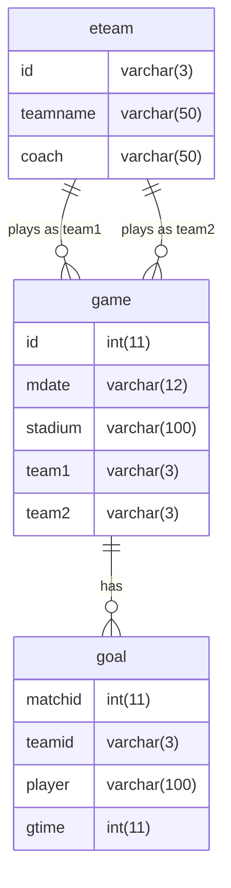

```mermaid
erDiagram
    eteam {
        id varchar(3)
        teamname varchar(50)
        coach varchar(50)
    }
    game {
        id int(11)
        mdate varchar(12)
        stadium varchar(100)
        team1 varchar(3)
        team2 varchar(3)
    }
    goal {
        matchid int(11)
        teamid varchar(3)
        player varchar(100)
        gtime int(11)
    }

    eteam ||--o{ game : "plays as team1"
    eteam ||--o{ game : "plays as team2"
    game ||--o{ goal : "has"
```
