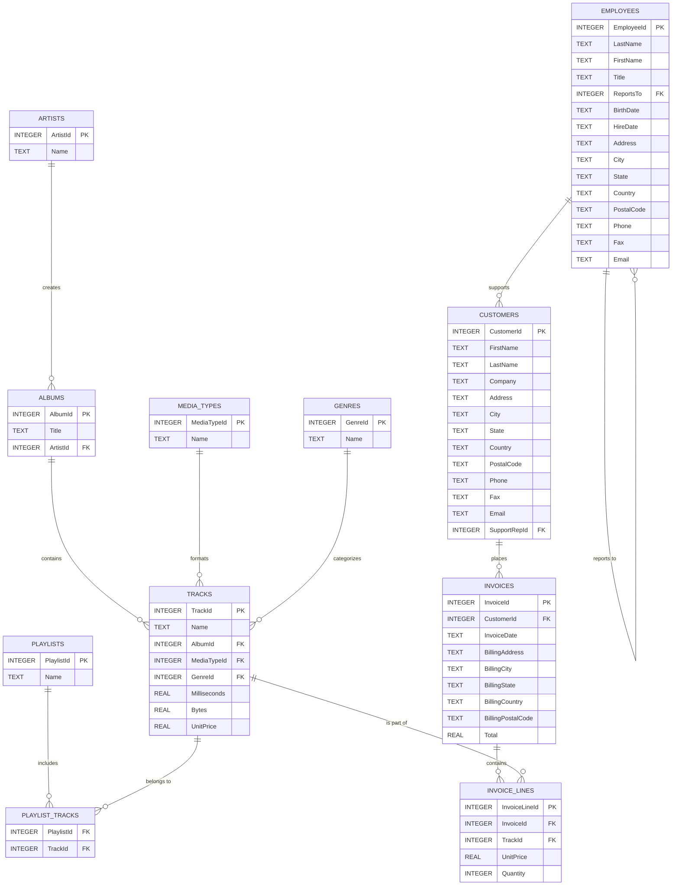

```mermaid
erDiagram
    ALBUMS {
        INTEGER AlbumId PK
        TEXT Title
        INTEGER ArtistId FK
    }
    ARTISTS {
        INTEGER ArtistId PK
        TEXT Name
    }
    TRACKS {
        INTEGER TrackId PK
        TEXT Name
        INTEGER AlbumId FK
        INTEGER MediaTypeId FK
        INTEGER GenreId FK
        REAL Milliseconds
        REAL Bytes
        REAL UnitPrice
    }
    MEDIA_TYPES {
        INTEGER MediaTypeId PK
        TEXT Name
    }
    GENRES {
        INTEGER GenreId PK
        TEXT Name
    }
    PLAYLISTS {
        INTEGER PlaylistId PK
        TEXT Name
    }
    PLAYLIST_TRACKS {
        INTEGER PlaylistId FK
        INTEGER TrackId FK
    }
    CUSTOMERS {
        INTEGER CustomerId PK
        TEXT FirstName
        TEXT LastName
        TEXT Company
        TEXT Address
        TEXT City
        TEXT State
        TEXT Country
        TEXT PostalCode
        TEXT Phone
        TEXT Fax
        TEXT Email
        INTEGER SupportRepId FK
    }
    INVOICES {
        INTEGER InvoiceId PK
        INTEGER CustomerId FK
        TEXT InvoiceDate
        TEXT BillingAddress
        TEXT BillingCity
        TEXT BillingState
        TEXT BillingCountry
        TEXT BillingPostalCode
        REAL Total
    }
    INVOICE_LINES {
        INTEGER InvoiceLineId PK
        INTEGER InvoiceId FK
        INTEGER TrackId FK
        REAL UnitPrice
        INTEGER Quantity
    }
    EMPLOYEES {
        INTEGER EmployeeId PK
        TEXT LastName
        TEXT FirstName
        TEXT Title
        INTEGER ReportsTo FK
        TEXT BirthDate
        TEXT HireDate
        TEXT Address
        TEXT City
        TEXT State
        TEXT Country
        TEXT PostalCode
        TEXT Phone
        TEXT Fax
        TEXT Email
    }

    ALBUMS ||--o{ TRACKS : "contains"
    ARTISTS ||--o{ ALBUMS : "creates"
    MEDIA_TYPES ||--o{ TRACKS : "formats"
    GENRES ||--o{ TRACKS : "categorizes"
    PLAYLISTS ||--o{ PLAYLIST_TRACKS : "includes"
    TRACKS ||--o{ PLAYLIST_TRACKS : "belongs to"
    CUSTOMERS ||--o{ INVOICES : "places"
    INVOICES ||--o{ INVOICE_LINES : "contains"
    TRACKS ||--o{ INVOICE_LINES : "is part of"
    EMPLOYEES ||--o{ CUSTOMERS : "supports"
    EMPLOYEES ||--o{ EMPLOYEES : "reports to"
```