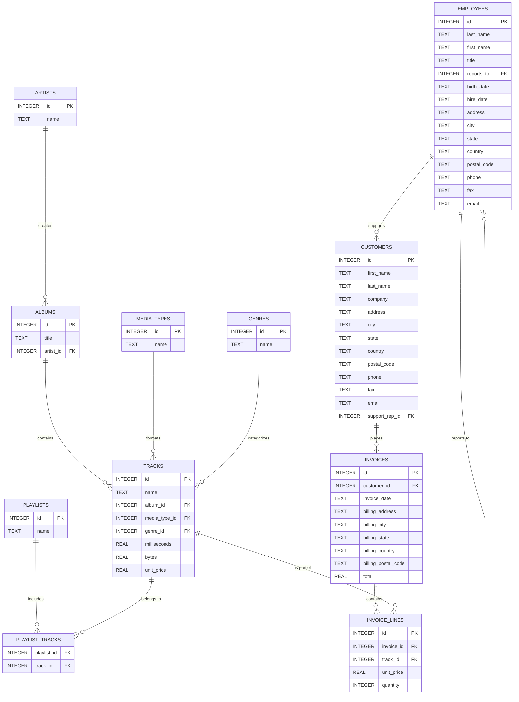

```mermaid
erDiagram
    ALBUMS {
        INTEGER id PK
        TEXT title
        INTEGER artist_id FK
    }
    ARTISTS {
        INTEGER id PK
        TEXT name
    }
    TRACKS {
        INTEGER id PK
        TEXT name
        INTEGER album_id FK
        INTEGER media_type_id FK
        INTEGER genre_id FK
        REAL milliseconds
        REAL bytes
        REAL unit_price
    }
    MEDIA_TYPES {
        INTEGER id PK
        TEXT name
    }
    GENRES {
        INTEGER id PK
        TEXT name
    }
    PLAYLISTS {
        INTEGER id PK
        TEXT name
    }
    PLAYLIST_TRACKS {
        INTEGER playlist_id FK
        INTEGER track_id FK
    }
    CUSTOMERS {
        INTEGER id PK
        TEXT first_name
        TEXT last_name
        TEXT company
        TEXT address
        TEXT city
        TEXT state
        TEXT country
        TEXT postal_code
        TEXT phone
        TEXT fax
        TEXT email
        INTEGER support_rep_id FK
    }
    INVOICES {
        INTEGER id PK
        INTEGER customer_id FK
        TEXT invoice_date
        TEXT billing_address
        TEXT billing_city
        TEXT billing_state
        TEXT billing_country
        TEXT billing_postal_code
        REAL total
    }
    INVOICE_LINES {
        INTEGER id PK
        INTEGER invoice_id FK
        INTEGER track_id FK
        REAL unit_price
        INTEGER quantity
    }
    EMPLOYEES {
        INTEGER id PK
        TEXT last_name
        TEXT first_name
        TEXT title
        INTEGER reports_to FK
        TEXT birth_date
        TEXT hire_date
        TEXT address
        TEXT city
        TEXT state
        TEXT country
        TEXT postal_code
        TEXT phone
        TEXT fax
        TEXT email
    }

    ALBUMS ||--o{ TRACKS : "contains"
    ARTISTS ||--o{ ALBUMS : "creates"
    MEDIA_TYPES ||--o{ TRACKS : "formats"
    GENRES ||--o{ TRACKS : "categorizes"
    PLAYLISTS ||--o{ PLAYLIST_TRACKS : "includes"
    TRACKS ||--o{ PLAYLIST_TRACKS : "belongs to"
    CUSTOMERS ||--o{ INVOICES : "places"
    INVOICES ||--o{ INVOICE_LINES : "contains"
    TRACKS ||--o{ INVOICE_LINES : "is part of"
    EMPLOYEES ||--o{ CUSTOMERS : "supports"
    EMPLOYEES ||--o{ EMPLOYEES : "reports to"
```
