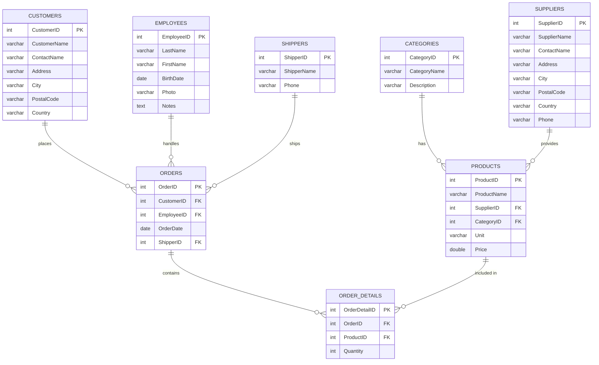

```mermaid
erDiagram
    CATEGORIES {
        int CategoryID PK
        varchar CategoryName
        varchar Description
    }
    
    CUSTOMERS {
        int CustomerID PK
        varchar CustomerName
        varchar ContactName
        varchar Address
        varchar City
        varchar PostalCode
        varchar Country
    }
    
    EMPLOYEES {
        int EmployeeID PK
        varchar LastName
        varchar FirstName
        date BirthDate
        varchar Photo
        text Notes
    }
    
    ORDER_DETAILS {
        int OrderDetailID PK
        int OrderID FK
        int ProductID FK
        int Quantity
    }
    
    ORDERS {
        int OrderID PK
        int CustomerID FK
        int EmployeeID FK
        date OrderDate
        int ShipperID FK
    }
    
    PRODUCTS {
        int ProductID PK
        varchar ProductName
        int SupplierID FK
        int CategoryID FK
        varchar Unit
        double Price
    }
    
    SHIPPERS {
        int ShipperID PK
        varchar ShipperName
        varchar Phone
    }
    
    SUPPLIERS {
        int SupplierID PK
        varchar SupplierName
        varchar ContactName
        varchar Address
        varchar City
        varchar PostalCode
        varchar Country
        varchar Phone
    }
    
    CATEGORIES ||--o{ PRODUCTS : "has"
    CUSTOMERS ||--o{ ORDERS : "places"
    EMPLOYEES ||--o{ ORDERS : "handles"
    ORDERS ||--o{ ORDER_DETAILS : "contains"
    PRODUCTS ||--o{ ORDER_DETAILS : "included in"
    SHIPPERS ||--o{ ORDERS : "ships"
    SUPPLIERS ||--o{ PRODUCTS : "provides"
```
