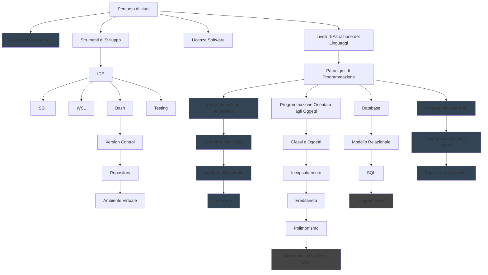

# Percorso di studi

```mermaid
graph TD
    AB[Percorso di studi]

    AB --> AD
    AD[Concetti fondamentali]
    style AD fill:#345

    AB --> A
    A[Strumenti di Sviluppo] --> B[IDE]
    B --> C[SSH]
    B --> D[WSL]
    B --> E[Bash]
    B --> I[Testing]
    E --> F[Version Control]
    F --> G[Repository]
    G --> H[Ambiente Virtuale]

    AB --> AC
    AC[Licenze Software]

    AB --> J
    J[Livelli di Astrazione dei Linguaggi] --> K[Paradigmi di Programmazione]

    K --> L[Programmazione Imperativa]
    L --> M[Variabili e Tipi di Dati]
    M --> N[Strutture di Controllo]
    N --> O[Funzioni]
    style L fill:#345
    style M fill:#345
    style N fill:#345
    style O fill:#345

    K --> P
    P[Programmazione Orientata agli Oggetti] --> Q[Classi e Oggetti]
    Q --> R[Incapsulamento]
    R --> S[Ereditarietà]
    S --> T[Polimorfismo]
    T .-> Z[Diagrammi delle Classi UML]
    style Z fill:#444

    K --> U
    U[Database] --> V[Modello Relazionale]
    V --> W[SQL]
    W .-> AA[Diagrammi ER]
    style AA fill:#444

    K --> AE
    AE[Programmazione Web] --> AF[Programmazione lato server]
    AF --> AG[Pagine web dinamiche]
    style AE fill:#345
    style AF fill:#345
    style AG fill:#345


```
