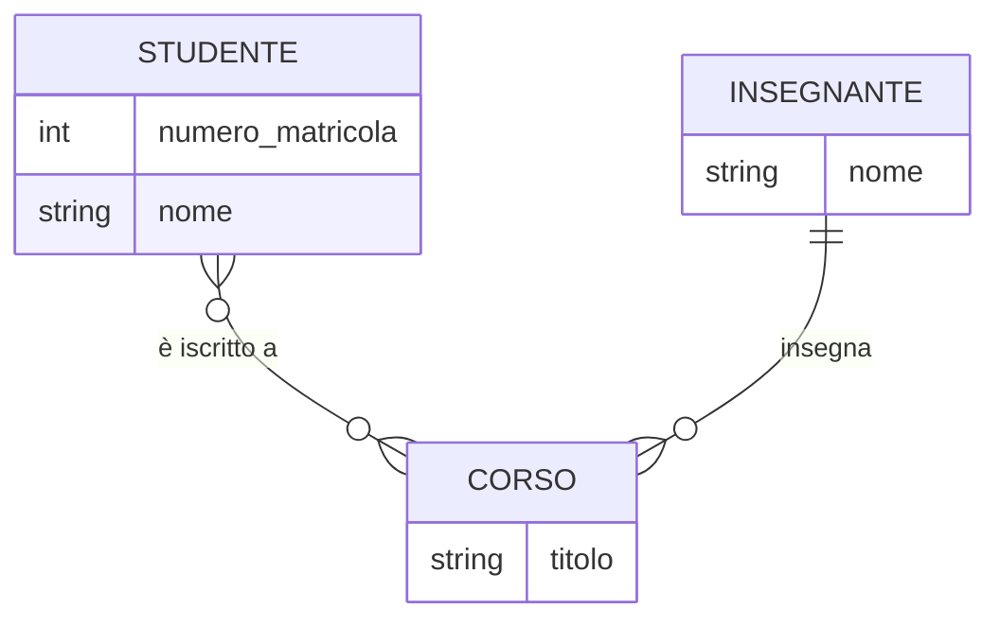

## Schema Concettuale e Diagrammi ER <!-- omit in toc -->

- [Che Cos'è uno Schema Concettuale?](#che-cosè-uno-schema-concettuale)
  - [Esempio di Schema Concettuale](#esempio-di-schema-concettuale)
- [Diagrammi ER (Entity-Relationship)](#diagrammi-er-entity-relationship)
  - [Componenti Principali di un Diagramma ER](#componenti-principali-di-un-diagramma-er)
    - [1. Entità](#1-entità)
    - [2. Attributi](#2-attributi)
    - [3. Relazioni](#3-relazioni)
    - [4. Cardinalità delle Relazioni](#4-cardinalità-delle-relazioni)
  - [Esempio di Diagramma ER](#esempio-di-diagramma-er)
- [Vantaggi dell'Uso dei Diagrammi ER](#vantaggi-delluso-dei-diagrammi-er)
- [Processo di Conversione in Modello Relazionale](#processo-di-conversione-in-modello-relazionale)

La progettazione concettuale di un database è uno dei passaggi fondamentali per la creazione di un sistema di gestione dati ben strutturato. Lo **schema concettuale** rappresenta una visione ad alto livello del database, descrivendo i dati e le relazioni tra essi in modo indipendente da qualsiasi specifica implementazione tecnica. Questo modello aiuta a comprendere la struttura logica dei dati, facilitando la comunicazione tra i progettisti e gli utenti finali.

Uno degli strumenti più utilizzati per la progettazione concettuale di un database è il **diagramma ER (Entity-Relationship)**, che permette di visualizzare in modo intuitivo le entità e le relazioni presenti nel sistema.

### Che Cos'è uno Schema Concettuale?

Lo **schema concettuale** è una rappresentazione astratta e indipendente dalla tecnologia di come i dati sono organizzati all'interno di un sistema informativo. Si tratta di un modello che descrive:

- Le **entità**, che rappresentano i principali oggetti di interesse per il sistema.
- Gli **attributi**, ovvero le proprietà o caratteristiche delle entità.
- Le **relazioni** tra le entità, che definiscono i collegamenti logici tra i vari oggetti.

Lo scopo dello schema concettuale è quello di fornire una base solida per la successiva progettazione logica e fisica del database.

#### Esempio di Schema Concettuale

Immaginiamo di dover progettare un database per una scuola. Alcune delle entità principali potrebbero essere "Studente", "Corso" e "Insegnante". Gli attributi di "Studente" potrebbero includere il nome, la data di nascita e il numero di matricola, mentre per "Corso" potremmo avere il nome del corso e il numero di crediti.

### Diagrammi ER (Entity-Relationship)

Il **diagramma ER** è lo strumento grafico utilizzato per rappresentare visivamente lo schema concettuale di un database. Fu introdotto nel 1976 da Peter Chen e, da allora, è diventato uno standard per la progettazione di database relazionali. Il diagramma ER utilizza simboli per rappresentare le entità, gli attributi e le relazioni, facilitando la comprensione della struttura del database.

#### Componenti Principali di un Diagramma ER

##### 1. Entità

Le **entità** rappresentano i principali oggetti o concetti nel sistema informativo. Ogni entità può essere vista come un "insieme di cose", in cui ogni istanza è un oggetto individuale.

- **Esempi**: "Studente", "Corso", "Insegnante"

##### 2. Attributi

Gli **attributi** sono le proprietà che descrivono un'entità. Ogni attributo può avere un valore specifico per ogni istanza dell'entità.

- **Esempi**: Per l'entità "Studente", gli attributi possono essere "Nome", "Data di Nascita", "Matricola".

##### 3. Relazioni

Le **relazioni** descrivono le associazioni tra due o più entità. Una relazione può essere di vari tipi, come uno-a-uno, uno-a-molti, o molti-a-molti.

- **Esempi**: Un "Insegnante" può insegnare più "Corsi", e uno "Studente" può essere iscritto a più "Corsi".

##### 4. Cardinalità delle Relazioni

La **cardinalità** delle relazioni specifica il numero di istanze di un'entità che possono essere associate a una specifica istanza di un'altra entità. I tre tipi principali di cardinalità sono:

- **Uno-a-uno (1:1)**: Un'entità A è associata a una sola entità B, e viceversa.
- **Uno-a-molti (1:N)**: Un'entità A è associata a molte entità B, ma un'entità B è associata a una sola entità A.
- **Molti-a-molti (N:M)**: Più entità A possono essere associate a più entità B.

**Esempio**: Nella relazione tra "Corso" e "Studente", un corso può avere molti studenti iscritti, ma uno studente può essere iscritto a più corsi. Questa è una relazione di tipo molti-a-molti.

#### Esempio di Diagramma ER

Immaginiamo di creare un diagramma ER per un sistema scolastico. Le entità principali potrebbero essere "Studente", "Corso" e "Insegnante". Le relazioni potrebbero includere "Iscritto a" (tra Studente e Corso) e "Insegna" (tra Insegnante e Corso). Gli attributi potrebbero includere il nome e il numero di matricola per lo studente, e il titolo del corso per il corso.

In questo diagramma, possiamo vedere che gli studenti possono iscriversi a più corsi, e ogni corso può essere insegnato da un solo insegnante.

### Vantaggi dell'Uso dei Diagrammi ER

L'utilizzo di diagrammi ER nella progettazione concettuale del database presenta numerosi vantaggi:

- **Visualizzazione chiara**: I diagrammi ER rendono visibile la struttura del database, facilitando la comprensione anche da parte di chi non è esperto di database.
- **Indipendenza dalla tecnologia**: Essendo un modello concettuale, il diagramma ER non dipende dalla tecnologia di implementazione, rendendo più facile passare da un sistema all'altro.
- **Facilitazione della comunicazione**: I diagrammi ER migliorano la comunicazione tra sviluppatori, progettisti e utenti finali, assicurando che tutte le parti coinvolte abbiano una comprensione comune della struttura del database.

### Processo di Conversione in Modello Relazionale

Una volta completato lo schema concettuale attraverso il diagramma ER, il passo successivo è la conversione del modello concettuale in un **modello relazionale**. Questo processo implica la trasformazione delle entità in tabelle e delle relazioni in chiavi esterne, mantenendo l'integrità dei dati e rispettando le regole del **modello relazionale**.

> **Nota**: La conversione del modello ER in modello relazionale verrà approfondita nella lezione dedicata al **Modello Relazionale**.
