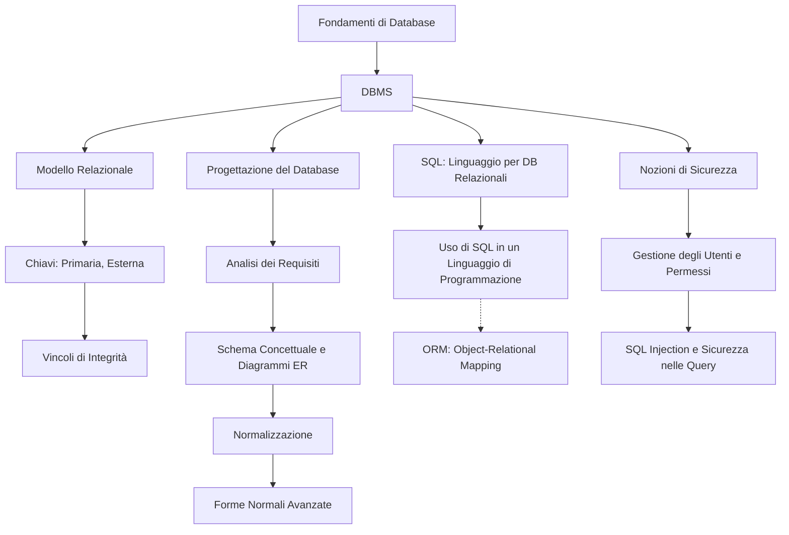

# Percorso DB

```mermaid
graph TD
    A[Fondamenti di Database]
    A --> B[DBMS]
    B --> C[Modello Relazionale]
    C --> D[Chiavi: Primaria, Esterna]
    D --> M[Vincoli di Integrità]

    B --> E[Progettazione del Database]
    E --> X[Analisi dei Requisiti]
    X --> F[Schema Concettuale e Diagrammi ER]
    F --> G[Normalizzazione]
    G --> H[Forme Normali Avanzate]

    B --> J[SQL: Linguaggio per DB Relazionali]
    J --> Y[Uso di SQL in un Linguaggio di Programmazione]
    Y -.-> W[ORM: Object-Relational Mapping]

    B --> T[Nozioni di Sicurezza]
    T --> U[Gestione degli Utenti e Permessi]
    U --> V[SQL Injection e Sicurezza nelle Query]
```