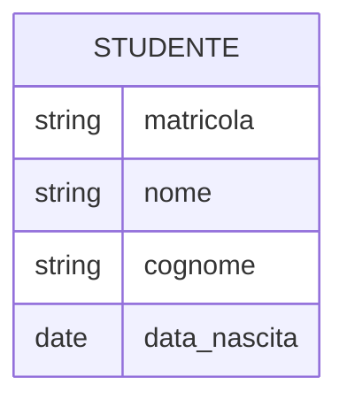
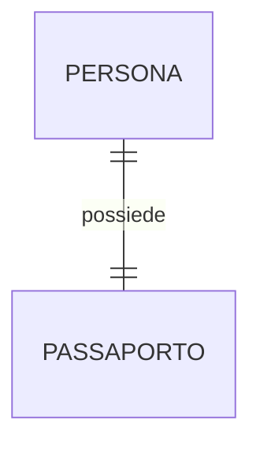
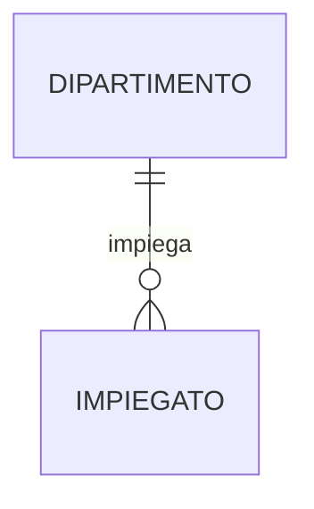
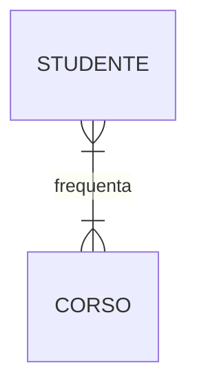
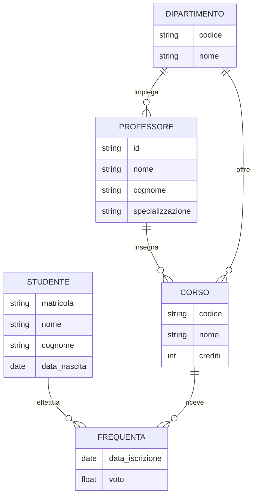

## Diagrammi Entity-Relationship (ER) <!-- omit in toc -->

- [Introduzione ai Diagrammi Entity-Relationship](#introduzione-ai-diagrammi-entity-relationship)
- [Componenti Fondamentali dei Diagrammi ER](#componenti-fondamentali-dei-diagrammi-er)
  - [Entità](#entità)
  - [Attributi](#attributi)
  - [Relazioni](#relazioni)
- [Cardinalità nelle Relazioni](#cardinalità-nelle-relazioni)
- [Tipi di Relazioni](#tipi-di-relazioni)
  - [Relazione Uno a Uno (1:1)](#relazione-uno-a-uno-11)
  - [Relazione Uno a Molti (1:N)](#relazione-uno-a-molti-1n)
  - [Relazione Molti a Molti (M:N)](#relazione-molti-a-molti-mn)
- [Esempio Completo di Diagramma ER](#esempio-completo-di-diagramma-er)
- [Considerazioni Finali](#considerazioni-finali)

### Introduzione ai Diagrammi Entity-Relationship

I diagrammi Entity-Relationship (ER) sono uno strumento potente per la modellazione concettuale dei dati in un sistema informativo. Sviluppati da Peter Chen nel 1976, questi diagrammi forniscono una rappresentazione grafica delle entità all'interno di un sistema, dei loro attributi e delle relazioni tra di esse. I diagrammi ER sono ampiamente utilizzati nella progettazione di database, nell'analisi dei requisiti e nella comunicazione tra stakeholder e sviluppatori.

### Componenti Fondamentali dei Diagrammi ER

#### Entità

Un'entità rappresenta un oggetto o un concetto del mondo reale che può essere identificato in modo univoco. Nelle rappresentazioni grafiche, le entità sono solitamente raffigurate come rettangoli.

#### Attributi

Gli attributi sono proprietà o caratteristiche di un'entità.

#### Relazioni

Le relazioni descrivono come le entità sono collegate tra loro. Sono rappresentate da linee che connettono le entità.

### Cardinalità nelle Relazioni

La cardinalità specifica il numero di istanze di un'entità che possono essere associate a un'istanza dell'altra entità nella relazione. Le cardinalità comuni includono:

- Uno a uno (1:1)
- Uno a molti (1:N)
- Molti a molti (M:N)

### Tipi di Relazioni

#### Relazione Uno a Uno (1:1)

In una relazione uno a uno, un'istanza di un'entità è associata a una sola istanza dell'altra entità e viceversa.

#### Relazione Uno a Molti (1:N)

In una relazione uno a molti, un'istanza di un'entità può essere associata a più istanze dell'altra entità, ma non viceversa.

#### Relazione Molti a Molti (M:N)

In una relazione molti a molti, un'istanza di un'entità può essere associata a più istanze dell'altra entità e viceversa.

### Esempio Completo di Diagramma ER

Ecco un esempio più complesso che mostra un diagramma ER per un sistema universitario semplificato:

### Considerazioni Finali

I diagrammi Entity-Relationship sono uno strumento potente per la modellazione dei dati, offrendo diversi vantaggi:

1. **Chiarezza concettuale**: Forniscono una rappresentazione visiva chiara della struttura dei dati.
2. **Comunicazione efficace**: Facilitano la comunicazione tra stakeholder tecnici e non tecnici.
3. **Base per il design del database**: Servono come punto di partenza per la progettazione di schemi di database relazionali.
4. **Flessibilità**: Possono essere facilmente modificati per adattarsi ai cambiamenti nei requisiti del sistema.

Tuttavia, è importante ricordare che i diagrammi ER sono una rappresentazione ad alto livello e potrebbero richiedere ulteriori raffinamenti durante la fase di implementazione del database. La pratica e l'esperienza sono fondamentali per creare diagrammi ER efficaci che catturino accuratamente la struttura e le relazioni dei dati in un sistema.
