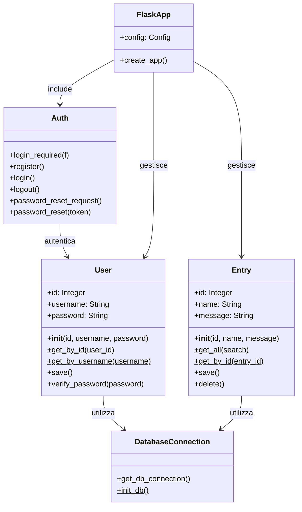

# Diagramma delle Classi

## Descrizione del Diagramma

Il diagramma delle classi mostra le principali entità dell'applicazione Flask e le loro relazioni:

- **User**: Gestisce le informazioni degli utenti e l'autenticazione

  - Metodi statici per recuperare utenti
  - Verifica delle password
  - Persistenza dei dati

- **Entry**: Gestisce i messaggi o le entità dell'applicazione

  - CRUD operations
  - Ricerca e filtraggio
  - Persistenza dei dati

- **DatabaseConnection**: Gestisce le connessioni al database MySQL

  - Connessione al database
  - Inizializzazione dello schema

- **Auth**: Gestisce l'autenticazione e l'autorizzazione

  - Decoratori per proteggere le route
  - Gestione login/logout
  - Reset password

- **FlaskApp**: Classe principale dell'applicazione
  - Configurazione
  - Creazione dell'app
  - Gestione delle route
