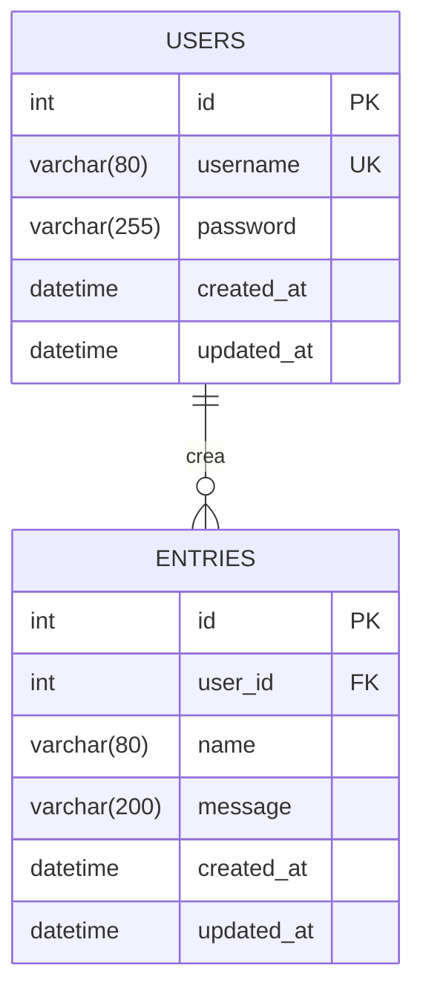

# Diagramma ER (Entity-Relationship)

## Descrizione del Diagramma

Il diagramma ER rappresenta la struttura del database dell'applicazione:

### Tabella USERS

- **Chiave Primaria**: id (auto-incrementale)
- **Campi**:
  - username: Nome utente univoco (VARCHAR 80)
  - password: Password hashata (VARCHAR 255)
  - created_at: Data di creazione
  - updated_at: Data ultimo aggiornamento
- **Vincoli**:
  - Username deve essere univoco
  - Password non può essere NULL

### Tabella ENTRIES

- **Chiave Primaria**: id (auto-incrementale)
- **Chiave Esterna**: user_id (riferimento a USERS.id)
- **Campi**:
  - name: Nome dell'entry (VARCHAR 80)
  - message: Contenuto del messaggio (VARCHAR 200)
  - created_at: Data di creazione
  - updated_at: Data ultimo aggiornamento
- **Vincoli**:
  - user_id deve esistere nella tabella USERS
  - name e message non possono essere NULL

### Relazioni

- Un utente può creare zero o più entries (relazione uno-a-molti)
- Ogni entry appartiene a esattamente un utente
- La cancellazione di un utente comporta la cancellazione delle sue entries (ON DELETE CASCADE)
