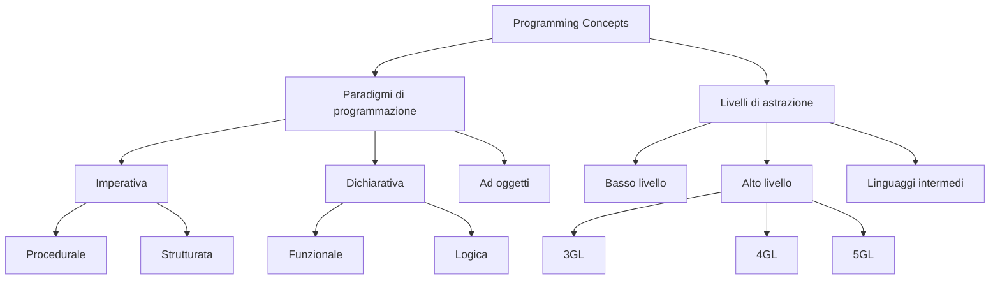

# Percorso tools

```mermaid
graph TD
    A[Programming Concepts]
    
    A --> B[Paradigmi di programmazione]
    B --> C[Imperativa]
    C --> D[Procedurale]
    C --> E[Strutturata]
    B --> F[Dichiarativa]
    F --> G[Funzionale]
    F --> H[Logica]
    B --> I[Ad oggetti]
    
    A --> L[Livelli di astrazione]
    L --> M[Basso livello]
    L --> N[Alto livello]
    N --> O[3GL]
    N --> P[4GL]
    N --> Q[5GL]
    L --> R[Linguaggi intermedi]
```