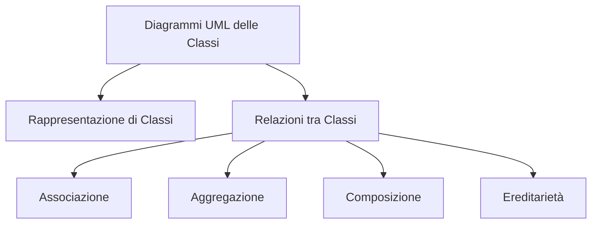

# Percorso UML

```mermaid
graph TD
    R[Diagrammi UML delle Classi]
    R --> S[Rappresentazione di Classi]
    R --> T[Relazioni tra Classi]
    T --> U[Associazione]
    T --> V[Aggregazione]
    T --> W[Composizione]
    T --> X[Ereditarietà]
```