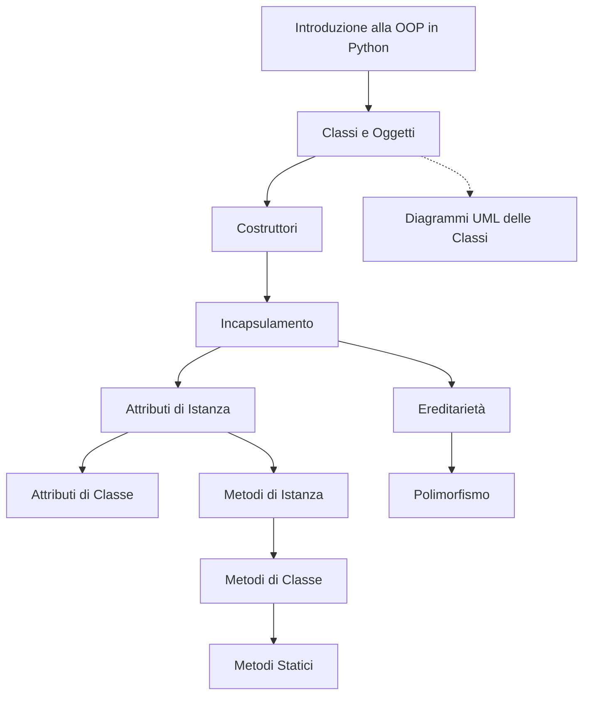

# Percorso OOP

```mermaid
graph TD
    A[Introduzione alla OOP in Python] --> B[Classi e Oggetti]
    B --> E[Costruttori]
    E --> F[Incapsulamento]
    F --> C[Attributi di Istanza]
    C --> I[Attributi di Classe]
    C --> D[Metodi di Istanza]
    D --> J[Metodi di Classe]
    J --> L[Metodi Statici]
    F --> G[Ereditarietà]
    G --> H[Polimorfismo]
    B -.-> K[Diagrammi UML delle Classi]
```