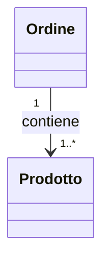
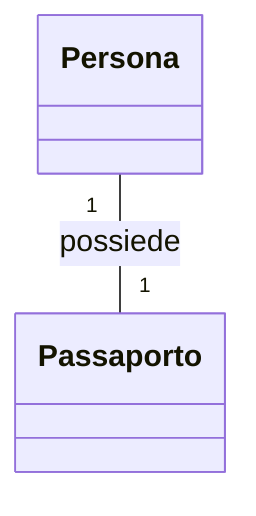
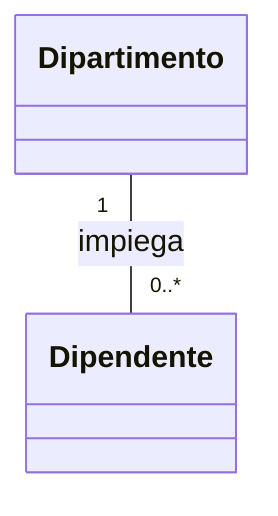
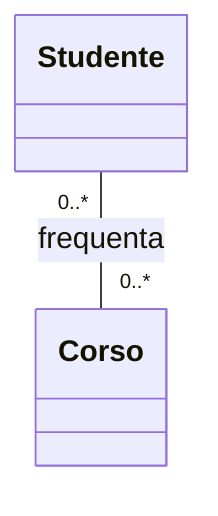

## Associazioni semplici <!-- omit in toc -->

- [Introduzione alle associazioni semplici](#introduzione-alle-associazioni-semplici)
- [Cardinalità nelle associazioni](#cardinalità-nelle-associazioni)
- [Direzionalità delle associazioni](#direzionalità-delle-associazioni)
- [Implementazione delle associazioni in Python](#implementazione-delle-associazioni-in-python)
  - [Associazione uno a uno](#associazione-uno-a-uno)
  - [Associazione uno a molti](#associazione-uno-a-molti)
  - [Associazione molti a molti](#associazione-molti-a-molti)

### Introduzione alle associazioni semplici

Le associazioni semplici nei diagrammi UML rappresentano le relazioni tra classi in un sistema orientato agli oggetti. Queste relazioni descrivono come gli oggetti di diverse classi interagiscono tra loro. Comprendere le associazioni è fondamentale per progettare sistemi robusti e traducibili in codice efficiente.

### Cardinalità nelle associazioni

La cardinalità (o molteplicità) in un'associazione UML indica quanti oggetti di una classe possono essere associati a un oggetto dell'altra classe. Le cardinalità più comuni sono:

- 1 (esattamente uno)
- 0..1 (zero o uno)
- 0..* (zero o più)
- 1..* (uno o più)
- n (un numero specifico)

Ecco un esempio di associazione con cardinalità:


In questo diagramma:
- Uno studente può frequentare zero o più corsi (0..*)
- Un corso può avere uno o più studenti (1..*)

### Direzionalità delle associazioni

La direzionalità di un'associazione indica se la relazione è navigabile in una o entrambe le direzioni:

1. **Associazione bidirezionale**: Entrambe le classi sono consapevoli l'una dell'altra.
2. **Associazione unidirezionale**: Solo una classe è consapevole dell'altra.

Esempio di associazione unidirezionale:



In questo caso, un `Ordine` conosce i suoi `Prodotti`, ma un `Prodotto` non sa a quale `Ordine` appartiene.

### Implementazione delle associazioni in Python

Vediamo come implementare diversi tipi di associazioni in Python.

#### Associazione uno a uno

UML:



Implementazione Python:

```python
class Passaporto:
    def __init__(self, numero):
        self.numero = numero
        self.proprietario = None

class Persona:
    def __init__(self, nome):
        self.nome = nome
        self.passaporto = None

    def assegna_passaporto(self, passaporto):
        self.passaporto = passaporto
        passaporto.proprietario = self

# Utilizzo
mario = Persona("Mario Rossi")
passaporto = Passaporto("AB123456")
mario.assegna_passaporto(passaporto)
```

#### Associazione uno a molti

UML:



Implementazione Python:

```python
class Dipendente:
    def __init__(self, nome):
        self.nome = nome
        self.dipartimento = None

class Dipartimento:
    def __init__(self, nome):
        self.nome = nome
        self.dipendenti = []

    def aggiungi_dipendente(self, dipendente):
        self.dipendenti.append(dipendente)
        dipendente.dipartimento = self

# Utilizzo
it_dept = Dipartimento("IT")
anna = Dipendente("Anna")
luca = Dipendente("Luca")

it_dept.aggiungi_dipendente(anna)
it_dept.aggiungi_dipendente(luca)
```

#### Associazione molti a molti

UML:



Implementazione Python:

```python
class Corso:
    def __init__(self, nome):
        self.nome = nome
        self.studenti = set()

    def iscrivi_studente(self, studente):
        self.studenti.add(studente)
        studente.corsi.add(self)

class Studente:
    def __init__(self, nome):
        self.nome = nome
        self.corsi = set()

    def iscrivi_a_corso(self, corso):
        self.corsi.add(corso)
        corso.studenti.add(self)

# Utilizzo
matematica = Corso("Matematica")
fisica = Corso("Fisica")
alice = Studente("Alice")
bob = Studente("Bob")

alice.iscrivi_a_corso(matematica)
alice.iscrivi_a_corso(fisica)
bob.iscrivi_a_corso(matematica)
```
