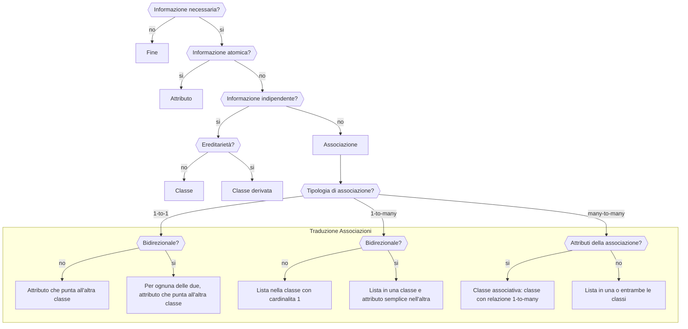

```mermaid
flowchart TD
    A{{Informazione necessaria?}}
    B1[Fine]
    B{{Informazione atomica?}}
    C1[Attributo]
    C{{Informazione indipendente?}}
    D1{{Ereditarietà?}}
    L[Classe]
    L1[Classe derivata]
    D[Associazione]
    E{{Tipologia di associazione?}}
    subgraph Traduzione Associazioni

        F{{Bidirezionale?}}
        I[Attributo che punta all'altra classe]
        I1[Per ognuna delle due, attributo che punta all'altra classe]
        G{{Bidirezionale?}}
        J[Lista nella classe con cardinalita 1]
        J1[Lista in una classe e attributo semplice nell'altra]
        H{{Attributi della associazione?}}
        K1[Classe associativa: classe con relazione 1-to-many]
        K[Lista in una o entrambe le classi]
    end

    A --> |si| B
    A --> |no| B1
    B --> |no| C
    B --> |si| C1
    C --> |no| D
    C --> |si| D1
    D --> E
    E -- "1-to-1" --> F
    E -- "1-to-many" --> G
    E -- "many-to-many" --> H
    F --> |no| I
    F --> |si| I1
    G --> |no| J
    G --> |si| J1
    H --> |no| K
    H --> |si| K1
    D1 --> |no| L
    D1 --> |si| L1
    
```
