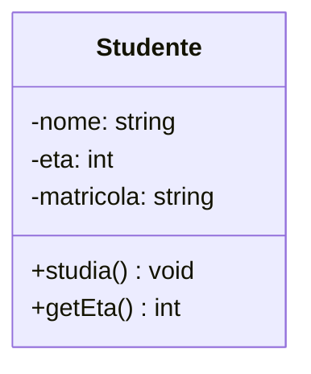
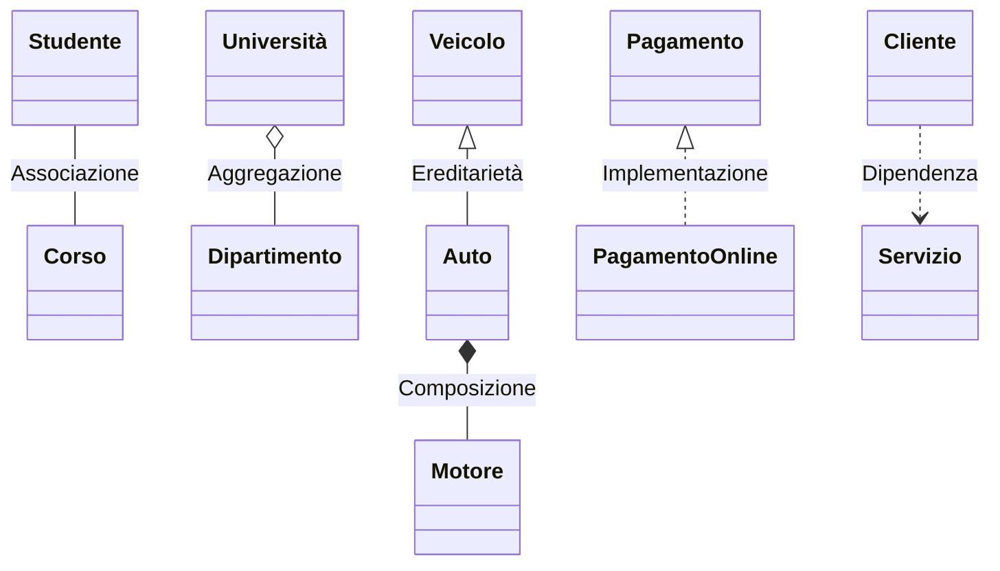
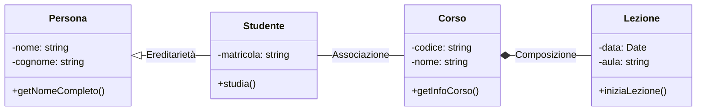

## Diagrammi delle classi UML <!-- omit in toc -->

- [Introduzione ai diagrammi delle classi UML](#introduzione-ai-diagrammi-delle-classi-uml)
- [Struttura di base di un diagramma delle classi](#struttura-di-base-di-un-diagramma-delle-classi)
- [Elementi di un diagramma delle classi](#elementi-di-un-diagramma-delle-classi)
- [Relazioni tra classi](#relazioni-tra-classi)
- [Esempi pratici](#esempi-pratici)
- [Vantaggi dell'uso dei diagrammi delle classi UML](#vantaggi-delluso-dei-diagrammi-delle-classi-uml)

### Introduzione ai diagrammi delle classi UML

I diagrammi delle classi UML (Unified Modeling Language) sono uno strumento fondamentale nella progettazione e documentazione di sistemi software orientati agli oggetti. Questi diagrammi forniscono una rappresentazione visuale della struttura statica di un sistema, mostrando le classi, i loro attributi, metodi e le relazioni tra di esse. Sono particolarmente utili per comunicare il design del sistema tra sviluppatori, architetti software e altri stakeholder del progetto.

### Struttura di base di un diagramma delle classi

Un diagramma delle classi UML è composto da diversi elementi grafici che rappresentano classi e le loro relazioni. La struttura base di una classe in un diagramma UML è rappresentata da un rettangolo diviso in tre sezioni:

1. **Nome della classe**: La sezione superiore contiene il nome della classe.
2. **Attributi**: La sezione centrale elenca gli attributi (proprietà) della classe.
3. **Metodi**: La sezione inferiore elenca i metodi (operazioni) della classe.

Esempio di rappresentazione di una classe:

### Elementi di un diagramma delle classi

1. **Visibilità**: La visibilità degli attributi e dei metodi è indicata da simboli:
   - `+` pubblico
   - `-` privato
   - `#` protetto

2. **Tipi di dati**: Ogni attributo è seguito dal suo tipo di dato (es. `string`, `int`, `boolean`).

3. **Parametri dei metodi**: I metodi possono includere parametri e tipo di ritorno.

Ecco il completamento con le associazioni mancanti:

### Relazioni tra classi

Le relazioni tra classi sono rappresentate da linee che collegano le classi:

1. **Associazione**: Una linea semplice tra due classi.
2. **Aggregazione**: Un diamante vuoto sulla classe "contenitore".
3. **Composizione**: Un diamante pieno sulla classe "contenitore".
4. **Ereditarietà**: Una freccia con punta triangolare vuota punta alla superclasse.
5. **Implementazione**: Una freccia tratteggiata con punta triangolare vuota punta all'interfaccia.
6. **Dipendenza**: Una linea tratteggiata con una freccia punta alla classe da cui dipende.

> In Python, le relazioni di associazione, aggregazione, composizione e dipendenza si traducono spesso in codice in modo simile, utilizzando attributi di classe che fanno riferimento ad altre classi. Le differenze tra queste relazioni sono principalmente semantiche e concettuali.

### Esempi pratici

Consideriamo un sistema universitario semplificato:

Questo diagramma mostra:
- Ereditarietà tra `Persona` e `Studente`
- Associazione tra `Studente` e `Corso`
- Composizione tra `Corso` e `Lezione`

### Vantaggi dell'uso dei diagrammi delle classi UML

1. **Visualizzazione chiara**: Forniscono una rappresentazione visiva immediata della struttura del sistema.
2. **Comunicazione efficace**: Facilitano la comunicazione tra membri del team e stakeholder.
3. **Documentazione**: Servono come documentazione di alto livello del design del sistema.
4. **Pianificazione**: Aiutano nella pianificazione e nella progettazione prima dell'implementazione.
5. **Manutenzione**: Facilitano la comprensione del sistema durante la fase di manutenzione.

I diagrammi delle classi UML sono uno strumento potente per la modellazione di sistemi orientati agli oggetti, offrendo una visione chiara e strutturata dell'architettura del software. La loro padronanza è essenziale per ogni sviluppatore e architetto software che lavora con sistemi complessi.
