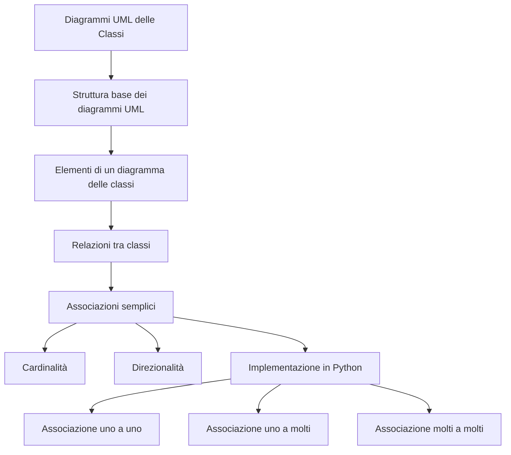

# Percorso UML

```mermaid
graph TD

    K[Diagrammi UML delle Classi]
    K --> O[Struttura base dei diagrammi UML]
    O --> P[Elementi di un diagramma delle classi]
    P --> Q[Relazioni tra classi]
    Q --> R[Associazioni semplici]
    R --> S[Cardinalità]
    R --> T[Direzionalità]
    R --> U[Implementazione in Python]
    U --> V[Associazione uno a uno]
    U --> W[Associazione uno a molti]
    U --> X[Associazione molti a molti]
```