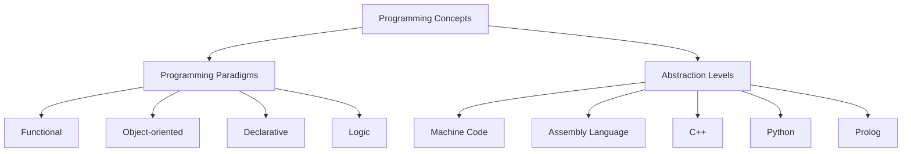

# Percorso tools

```mermaid
graph TD
    A[Programming Concepts]
    
    A --> B[Programming Paradigms]
    B --> C[Functional]
    B --> E[Object-oriented]
    B --> G[Declarative]
    B --> J[Logic]
    
    A --> L[Abstraction Levels]
    L --> M[Machine Code]
    L --> N[Assembly Language]
    L --> O[C++]
    L --> P[Python]
    L --> Q[Prolog]
```