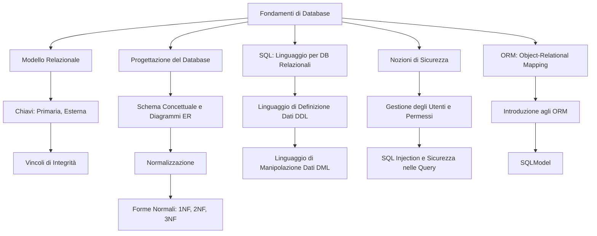

# Percorso DB

```mermaid
graph TD
    A[Fondamenti di Database]
    A --> C[Modello Relazionale]
    C --> D[Chiavi: Primaria, Esterna]
    D --> M[Vincoli di Integrità]

    A --> E[Progettazione del Database]
    E --> F[Schema Concettuale e Diagrammi ER]
    F --> G[Normalizzazione]
    G --> H[Forme Normali: 1NF, 2NF, 3NF]

    A --> J[SQL: Linguaggio per DB Relazionali]
    J --> K[Linguaggio di Definizione Dati DDL]
    K --> L[Linguaggio di Manipolazione Dati DML]

    A --> T[Nozioni di Sicurezza]
    T --> U[Gestione degli Utenti e Permessi]
    U --> V[SQL Injection e Sicurezza nelle Query]

    A --> W[ORM: Object-Relational Mapping]
    W --> X[Introduzione agli ORM]
    X --> Y[SQLModel]
```