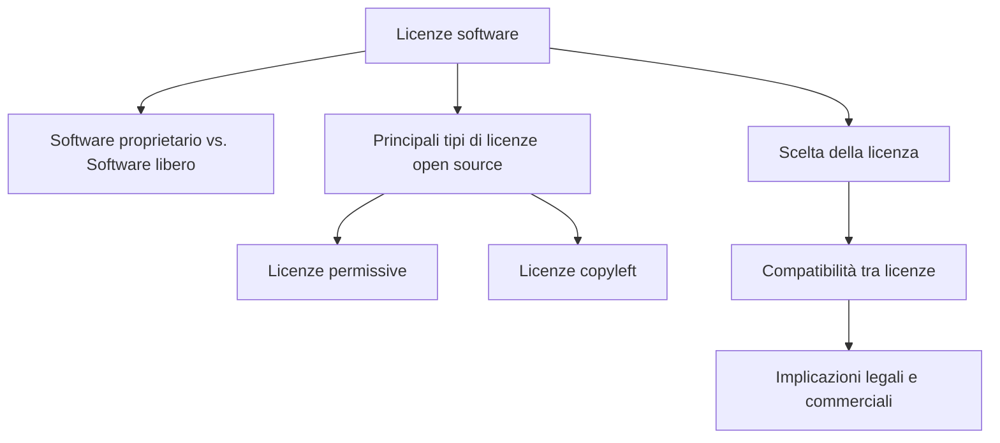

# Percorso software licenses

```mermaid
graph TD
    A[Licenze software]
    A --> C[Software proprietario vs. Software libero]
    A --> D[Principali tipi di licenze open source]
    D --> E[Licenze permissive]
    D --> F[Licenze copyleft]
    A --> L[Scelta della licenza]
    L --> M[Compatibilità tra licenze]
    M --> N[Implicazioni legali e commerciali]
```