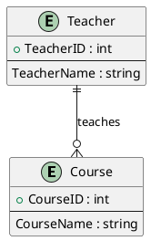

# ER

The **Entity-Relationship (ER) Model** is a type of data model that is used to visually represent the structure of a database in a clear and logical way. It is often used in the design and planning stages of a database system. Here are some key components of the ER model:

- **Entity**: An entity represents a real-world object or concept that can be distinctly identified. For example, in a university database, the entities might be Students, Courses, and Teachers.

- **Attributes**: Attributes are properties or characteristics of entities. For example, a Student entity might have attributes like StudentID, Name, and Major.

- **Relationship**: A relationship describes how entities are connected or related to each other. For example, a relationship might be "Student takes Course" or "Teacher teaches Course".

- **Cardinality**: Cardinality defines the numerical attributes of the relationship between two entities. It can be one-to-one, one-to-many, or many-to-many. For example, one Student can take many Courses, but each Course might be taught by only one Teacher.

Here's a simple example of an ER diagram:

In this diagram, Student and Course are entities, StudentID, Name, Major, CourseID, CourseName, and TeacherID are attributes, and "takes" is a relationship with a one-to-many cardinality from Student to Course.
