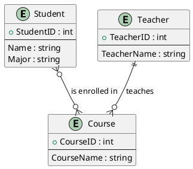

# From data to database

Creating a database from a document of requirements involves several steps:

1. **Requirements Gathering**: Understand the requirements document thoroughly. Identify the data that needs to be stored and the operations that need to be performed on the data.

2. **Conceptual Design**: Create an Entity-Relationship (ER) model. Identify the entities, attributes, relationships, and cardinalities.

3. **Logical Design**: Convert the ER model into a relational model. This involves creating tables for entities and relationships, determining primary and foreign keys, and ensuring normalization.

4. **Implementation**: Create the database using a Database Management System (DBMS). Define the tables, constraints, triggers, views, etc.

5. **Deployment and Maintenance**: Deploy the database and provide ongoing maintenance as needed. This includes monitoring performance, ensuring security, regular backups, updating as per new requirements, etc.

## Example

### Requirements Gathering

Let's say we are creating a database for a university. The requirements document might specify that the university needs to store information about students, courses, and the professors who teach those courses.

- For students, the university needs to store the student ID, name, major, and the courses they are enrolled in.
- For courses, the university needs to store the course ID, course name, the professor who teaches it, and the students who are enrolled in it.
- For professors, the university needs to store the professor ID, name, the course they teach, and the students they are teaching. A professor can teach only one course.

The operations that need to be performed on the data could include enrolling a student in a course, assigning a professor to a course, listing all students enrolled in a specific course, listing all courses a specific student is enrolled in, etc.

This step involves a lot of communication with the end-users to ensure that all their needs are understood and will be met by the database.

### Conceptual Design

Based on the requirements gathered, we identified three entities: Student, Course, and Teacher. We also identified the attributes for each entity and the relationships between them.

Here's how you can represent this in an ER diagram using PlantUML:



### Logical Design

In the logical design phase, we convert the ER model into a relational model. This involves creating tables for entities and relationships, determining primary and foreign keys, and ensuring normalization.

Here's how you can represent this in a relational model:

**Student Table**: | StudentID (PK) | Name | Major |

**Course Table**: | CourseID (PK) | CourseName | TeacherID (FK) |

**Teacher Table**: | TeacherID (PK) | TeacherName |

**Enrollment Table**: | StudentID (FK) | CourseID (FK) |

In this model:

- `StudentID`, `CourseID`, and `TeacherID` are primary keys (PK) in their respective tables.
- `TeacherID` in the `Course` table and `StudentID`, `CourseID` in the `Enrollment` table are foreign keys (FK), referencing the primary keys of their respective tables.
- The `Enrollment` table represents the many-to-many relationship between `Student` and `Course`.
- The `TeacherID` foreign key in the `Course` table represents the one-to-many relationship from `Teacher` to `Course`.

This design ensures normalization, reducing data redundancy and improving data integrity.

### Implementation

In the implementation phase, we create the database using a Database Management System (DBMS). For this example, let's use SQL syntax:

```sql
CREATE TABLE Student (
    StudentID INT PRIMARY KEY,
    Name VARCHAR(100),
    Major VARCHAR(100)
);

CREATE TABLE Teacher (
    TeacherID INT PRIMARY KEY,
    TeacherName VARCHAR(100)
);

CREATE TABLE Course (
    CourseID INT PRIMARY KEY,
    CourseName VARCHAR(100),
    TeacherID INT,
    FOREIGN KEY (TeacherID) REFERENCES Teacher(TeacherID)
);

CREATE TABLE Enrollment (
    StudentID INT,
    CourseID INT,
    PRIMARY KEY (StudentID, CourseID),
    FOREIGN KEY (StudentID) REFERENCES Student(StudentID),
    FOREIGN KEY (CourseID) REFERENCES Course(CourseID)
);
```

### Deployment and Maintenance

After the database has been implemented, the next step is to deploy it. This involves setting up the database on a server where it can be accessed by the end-users. The specific steps for deployment depend on the DBMS being used and the server environment.

Here's a general example of what this step might involve:

```bash
# Connect to the database server
mysql -u username -p

# Create a new database
CREATE DATABASE UniversityDB;

# Use the new database
USE UniversityDB;

# Run the SQL script to create the tables
SOURCE /path/to/your/sql/script.sql;
```
