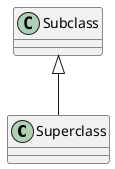
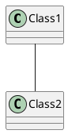
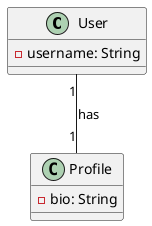
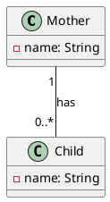
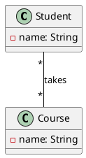

```toc
```

## Main elements of a class diagram

In a UML (Unified Modeling Language) class diagram, you can use the following main elements:

- `Classes`: These are represented as rectangles divided into three parts: the top part contains the class name, the middle part contains the attributes of the class, and the bottom part contains the methods or operations that the class can perform.

- `Associations`: These are represented as lines connecting classes, indicating a relationship between them. The multiplicity (one, many, etc.) can be indicated at each end of the line.

- Generalizations (`Inheritance`): These are represented as hollow arrowheads pointing from a subclass to a superclass, indicating that the subclass is a type of the superclass.

## Relationships between classes

In object-oriented programming (OOP), the two main relationships between classes:

1. **Inheritance:** A class inherits attributes and methods from another class, allowing it to reuse and extend the functionality of the parent class. This promotes code reusability and reduces redundancy. This is represented by `<|--`. The arrow points from the subclass to the superclass.



2. **Association:** A class is associated with another class when there is a connection between them. An Association represents a "using" relationship between two or more classes. It specifies that objects of one class are connected to objects of another In the context of PlantUML and UML diagrams, the `--` symbol is used to denote an association relationship between two classes.



## Associations in UML

### Association 1-1
1-1 Association: a User has one Profile in a system. This is a 1-1 association because each user has exactly one profile, and each profile belongs to exactly one user.



### Association 1-*
1-* Association: A Mother has Children. In this case, one mother can have zero or more children, but each child has exactly one biological mother.



### Association \*-\*
\*-\* Association: A Student takes Courses. In this case, one student can take multiple courses, and each course can have multiple students.




## Associations in Python

- [Association 1-1](association11.py)
- [Association 1-*](association1N.py)
- [Association \*-\*](associationNN.py)

- [Association 1-1 with back reference](association11_back_reference.py)
- [Association 1-* with back reference](association1N_back_reference.py)
- [Association \*-\* with back reference](associationNN_back_reference.py)
