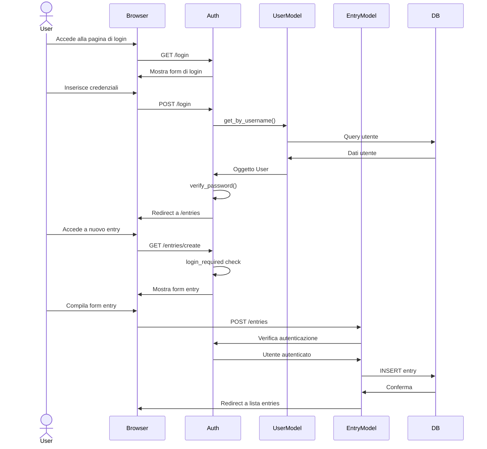

# Diagramma di Sequenza

## Descrizione del Diagramma

Il diagramma di sequenza illustra due flussi principali dell'applicazione:

### Flusso di Login

1. L'utente accede alla pagina di login
2. Il browser richiede il form di login
3. L'utente inserisce le credenziali
4. Il sistema verifica le credenziali:
   - Recupero dati utente dal database
   - Verifica della password
5. Redirect alla pagina entries dopo login riuscito

### Flusso di Creazione Entry

1. L'utente richiede il form di nuovo entry
2. Il sistema verifica l'autenticazione (login_required)
3. L'utente compila e invia il form
4. Il sistema:
   - Verifica l'autenticazione
   - Salva l'entry nel database
   - Redirect alla lista entries

### Note Importanti

- Tutti i flussi sono protetti dal decoratore `login_required`
- Le password sono sempre hashate
- Le sessioni utente sono gestite tramite Flask-Session
- Vengono implementati controlli di sicurezza ad ogni richiesta
- Gli errori vengono gestiti appropriatamente con messaggi user-friendly
