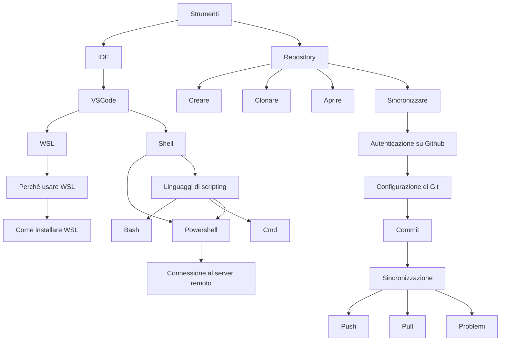

# Percorso tools

```mermaid
graph TD
    Z[Strumenti]
    Z[Strumenti] --> A[IDE]
    Z[Strumenti] --> F[Repository]

    A[IDE] 
    A --> B[VSCode]

    B[VSCode] 
    B --> Y[WSL] 
    B --> R[SSH in VSCode] 
    R --> V[Configurazione della connessione SSH]
    V --> W[Connessione al server remoto]

    Y[WSL] 
    Y --> AA[Perché usare WSL]
    AA --> AB[Come installare WSL]

    F[Repository] 
    F --> G[Creare]
    F --> H[Clonare]
    F --> I[Aprire]
    F --> J[Sincronizzare]

    J[Sincronizzare] 
    J --> K[Autenticazione su Github]
    K --> L[Configurazione di Git]
    L --> M[Commit]
    M --> N[Sincronizzazione]
    N --> O[Push]
    N --> P[Pull]
    N --> Q[Problemi]

    R[Shell] 
    R --> S[Linguaggi di scripting]
    S --> T[Bash]
    S --> U[Cmd]
    S --> V[Powershell]

```