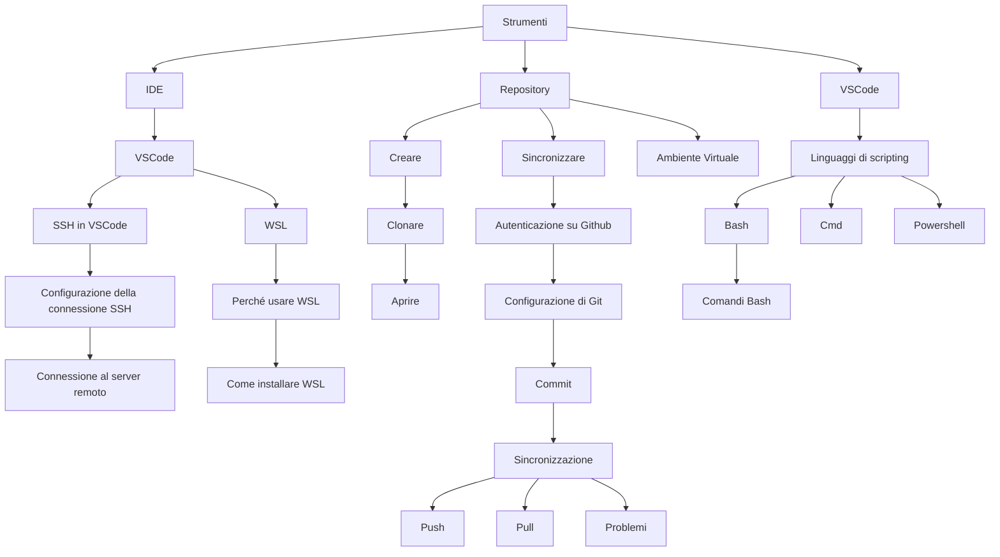

# Percorso tools

```mermaid
graph TD
    A[Strumenti]
    A --> B[IDE]
    A --> C[Repository]

    B[IDE] 
    B --> D[VSCode]

    D[VSCode] 
    D --> E[WSL] 
    D --> F[SSH in VSCode] 
    F --> G[Configurazione della connessione SSH]
    G --> H[Connessione al server remoto]

    E[WSL] 
    E --> I[Perché usare WSL]
    I --> J[Come installare WSL]

    C[Repository] 
    C --> K[Creare]
    K --> L[Clonare]
    L --> M[Aprire]
    C --> N[Sincronizzare]
    C --> O[Ambiente Virtuale]

    N[Sincronizzare] 
    N --> P[Autenticazione su Github]
    P --> Q[Configurazione di Git]
    Q --> R[Commit]
    R --> S[Sincronizzazione]
    S --> T[Push]
    S --> U[Pull]
    S --> V[Problemi]

    W[Shell] 
    A --> W[VSCode]
    W --> X[Linguaggi di scripting]
    X --> Y[Bash]
    X --> Z[Cmd]
    X --> AA[Powershell]
    Y --> AB[Comandi Bash]

```